# 服务模板说明文档

## 服务说明

本文介绍基于MySQL软件包快速构建托管版单租户计算巢服务，关于计算巢托管版可以参考[帮助文档](https://help.aliyun.com/zh/compute-nest/create-a-fully-managed-service?spm=a2c4g.11174283.0.i5)，
本示例采用ECS+SLB的架构，默认支持私网打通、网络变配与磁盘扩容功能。用户部署服务实例后，可以直接通过内网访问部署在服务商的MySQL，除此之外还配置了三种套餐，分别为：

| 套餐名 | SLB规格        | ECS规格族         | vCPU与内存          | 系统盘               | 公网带宽      |
|-----|--------------|----------------|------------------|-------------------|-----------|
| 低配版 | slb.s1.small | ecs.u1-c1m2.large   | 内存型c6，2vCPU 4GiB | ESSD云盘 200GiB PL0 | 固定带宽1Mbps |
| 基础版 | slb.s1.small | ecs.u1-c1m2.xlarge  | 内存型c6，4vCPU 8GiB | ESSD云盘 200GiB PL0 | 固定带宽1Mbps |
| 高配版 | slb.s3.small | ecs.u1-c1m2.2xlarge | 内存型c6，4vCPU 8GiB | ESSD云盘 200GiB PL0 | 固定带宽1Mbps |

本示例对应的Git仓库地址：[mysql-managed-demo](https://github.com/aliyun-computenest/mysql-managed-demo)

本示例会自动的构建计算巢服务，具体的服务构建流程为:

1. 将MySQL安装包（提前存放到该github repo中）构建为计算巢文件部署物
2. 创建计算巢服务并关联文件部署物

创建过程大约持续3分钟，当服务变成待提交后构建成功。

## 部署架构

本部署架构为SLB+ECS，安全组开放3306端口，并配置了终端节点。
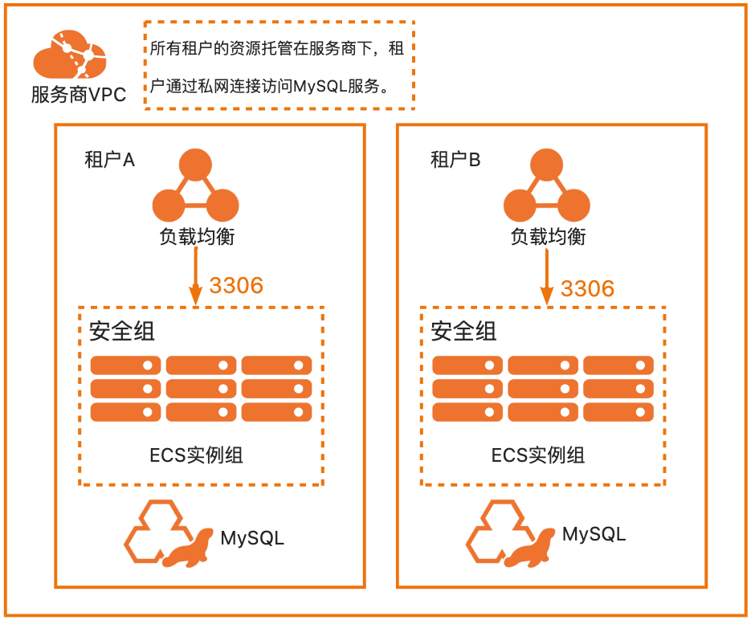

## 服务构建计费说明

测试本服务构建无需任何费用，创建服务实例涉及的费用参考服务实例计费说明。

## 服务实例计费说明

测试本服务在计算巢上的费用主要涉及：

- 所选vCPU与内存规格
- 系统盘类型及容量
- 公网带宽
- 私网连接费用

计费方式包括：

- 按量付费（小时）
- 包年包月

目前提供如下套餐：

| 套餐名 | SLB规格        | ECS规格族         | vCPU与内存          | 系统盘               | 公网带宽      |
|-----|--------------|----------------|------------------|-------------------|-----------|
| 低配版 | slb.s1.small | ecs.u1-c1m2.large   | 内存型c6，2vCPU 4GiB | ESSD云盘 200GiB PL0 | 固定带宽1Mbps |
| 基础版 | slb.s1.small | ecs.u1-c1m2.xlarge  | 内存型c6，4vCPU 8GiB | ESSD云盘 200GiB PL0 | 固定带宽1Mbps |
| 高配版 | slb.s3.small | ecs.u1-c1m2.2xlarge | 内存型c6，4vCPU 8GiB | ESSD云盘 200GiB PL0 | 固定带宽1Mbps |

预估费用在创建实例时可实时看到。私网连接只有在创建服务时候并建立连接后才会计费，具体的计费方式可以参考：https://help.aliyun.com/document_detail/198081.html?spm=a2c4g.120462.0.0.5f104bffA7i9WJ

## 部署流程

### 部署参数说明

| 参数族  | 参数项               | 说明                                                            |
|------|-------------------|---------------------------------------------------------------|
| 基础配置 | 数据库root和admin账户密码 | 数据库root和admin账户密码，长度8-32个字符，可包含大小字母、数字及特殊符号（包含：!@#$%^&*-+=_）。 |
| 网络配置 | 可用区               | 选择可用区，资源将在服务商的该可用区创建。                                         |
| 网络设置 | 专有网络              | 选择建立私网连接的VPC。                                                 |
| 网络设置 | 安全组               | 选择建立私网连接的安全组。                                                 |
| 网络设置 | 交换机和可用区           | 选择建立私网连接的可用区与交换机。                                             |

### 部署步骤

0. 部署链接
   
1. 单击部署链接，进入服务实例部署界面，根据界面提示，填写参数完成部署。
   
   网络设置部分如果填写网络信息，私网连接的终端节点将在该可用区创建。

   注：由于本服务开启了网络变配功能，若此处不开启私网连接，也可通过变配功能开启。详情见变配流程-变配私网连接。
   
2. 参数填写完成后点击**下一步：确认订单**确认参数。
   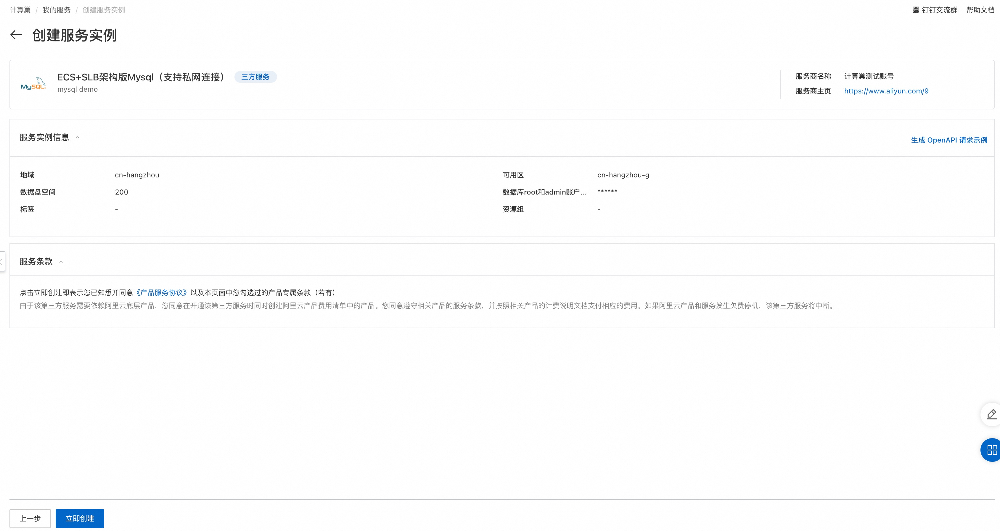
3. 确认订单完成后同意服务协议并点击**立即创建**，随后进入部署阶段。
   

   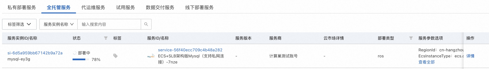
4. 等待部署完成后就可以开始使用服务。
   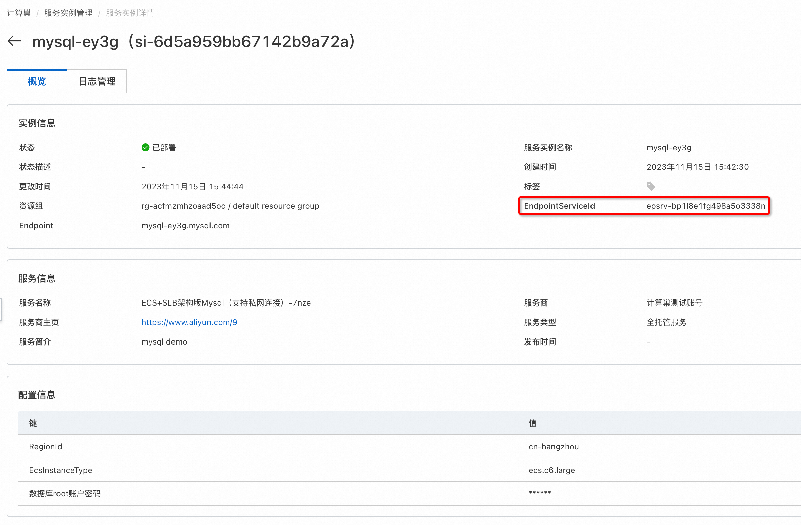
5. 使用服务
   1. 本服务支持私网访问，租户可以通过PrivateLink实现私网访问（[私网访问帮助文档](https://bp.aliyun.com/detail/186?spm=5176.9843921.content.344.4a604882OYKl3N)），
   租户私网访问流程：
       1. 在服务实例的虚拟互联网页签中查看详细信息，连接时可以通过自定义域名（如果在创建服务实例时勾选了的话）、IP地址或者可用区域名进行访问。
          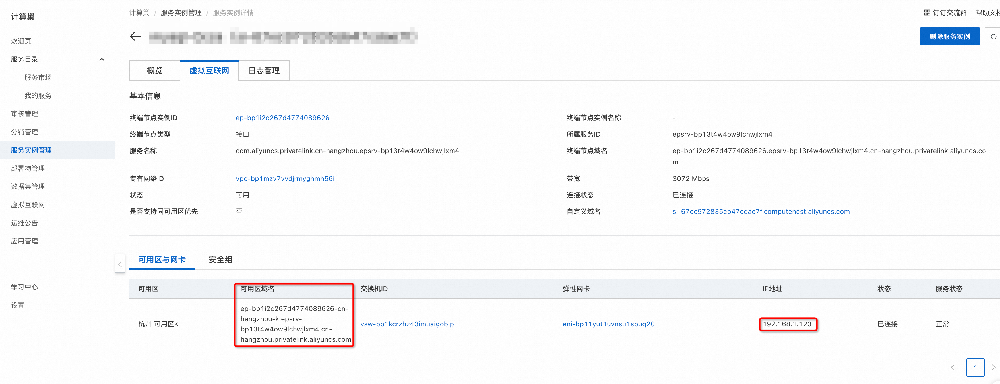
       2. 在对应的vsw中创建ECS，创建好后安装mysql客户端。
      ```
      yum install mysql
      or
      apt install mysql-client
      ```
       3. 在该ECS中连接MySQL，下面展示分别用自定义域名、IP与可用区域名进行连接：

           1. 自定义域名方式访问：
              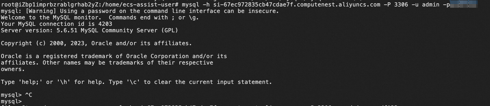
           2. 通过IP访问：
              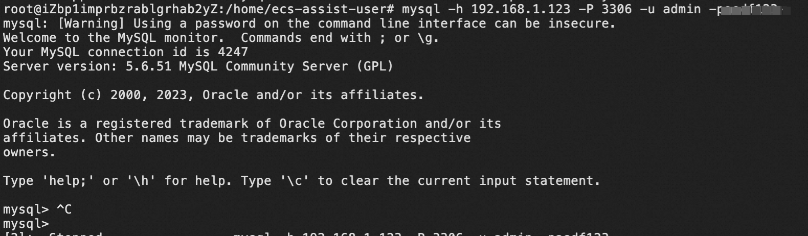
           3. 通过可用区域名访问：
              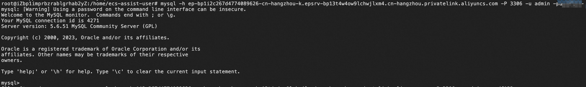
   2. 本服务支持修改服务配置参数。**请注意，修改参数会引起服务重启**。修改服务参数的流程：
      1.  进入服务实例详情：
          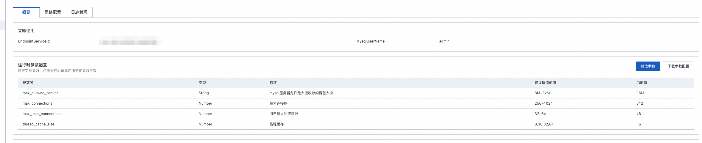
      2.  点击**修改参数**，编辑修改值，完成后点击**保存**。
          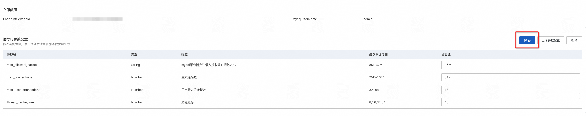
      3. 点击保存后，服务实例会进入参数更新流程，大致需要1~2分钟，请耐心等待。
         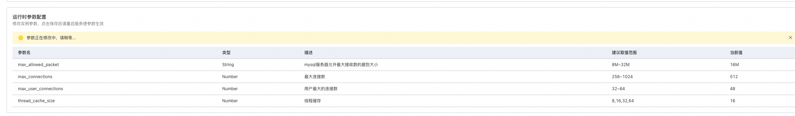
      4. 参数更新流程完成后，参数生效。
         
## 变配流程
        
### 说明
本服务默认开启支持变配私网连接、支持数据盘扩容。

私网连接变配：用户可以通过变配开启/关闭/新增/删除私网连接；

数据盘扩容：用户可通过变配扩容数据盘容量。

### 变配私网连接步骤

0. 前提说明：本变配示例为用户在创建服务实例时未开启私网连接，在服务实例创建完成后需要开启。
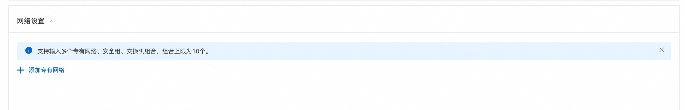
   用户已有服务实例未开启私网连接。

1. 点击右上角 **修改配置** 进入变配服务实例页面，选择**网络变配**。
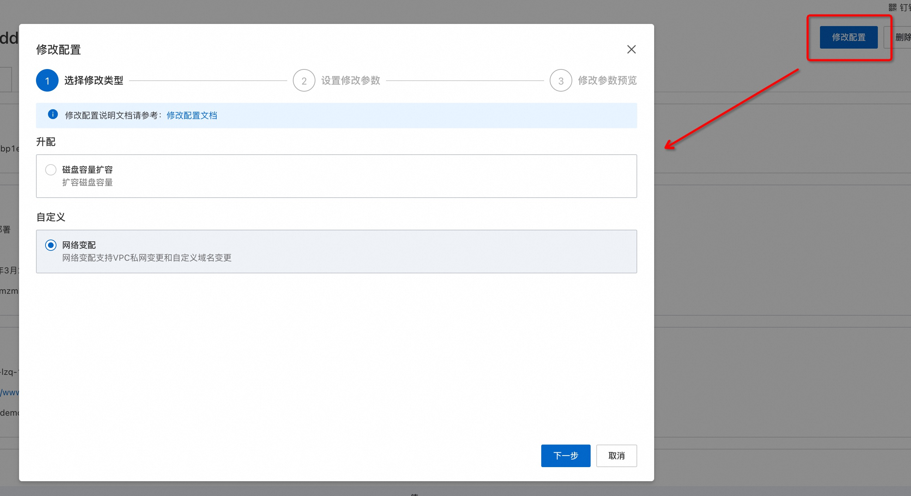
2. 点击**下一步**进入**设置修改参数**，添加私网连接参数。
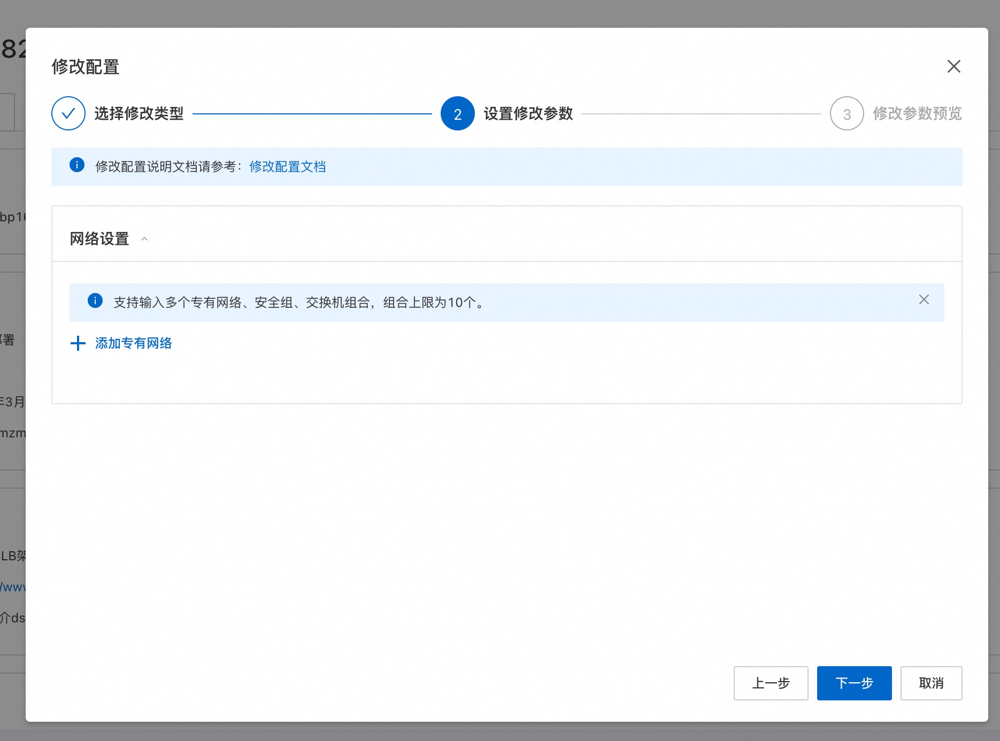
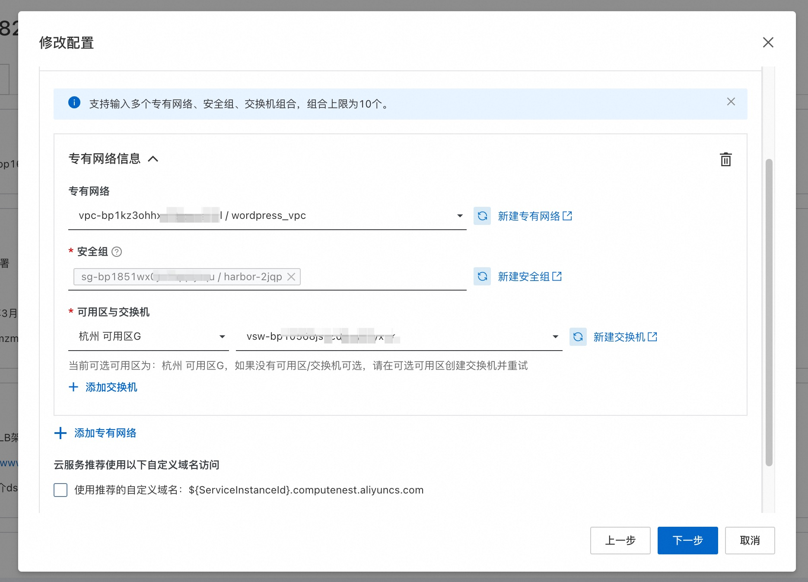
   注意：请确保填入的安全组入方向开启3306端口，否则私网访问将无法连接。
3. 点击**下一步**预览变配内容。
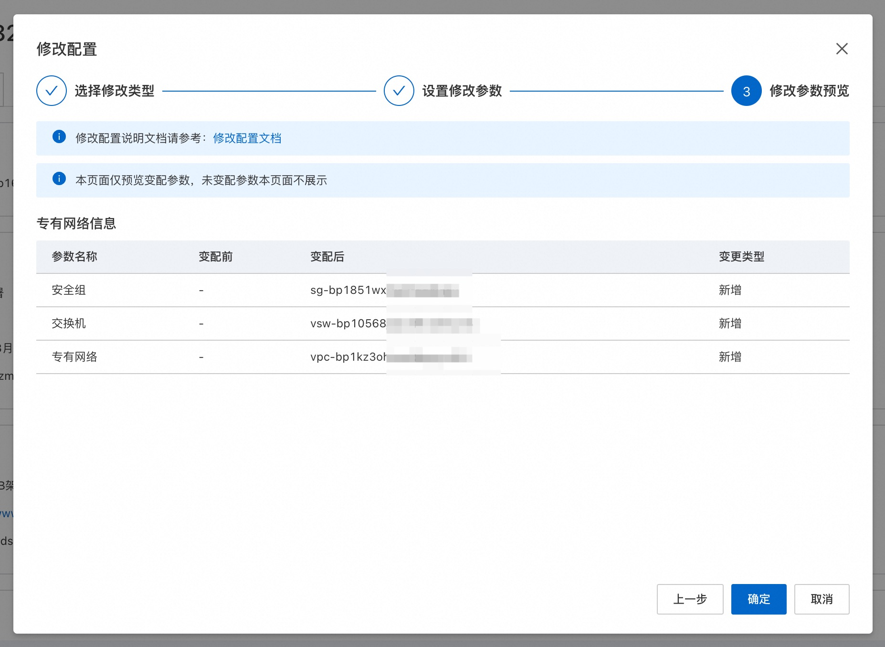
4. 点击**确定**开始执行变配，等待变配完成。
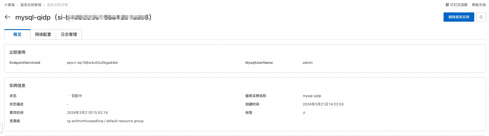
5. 变配完成，服务实例状态变为已部署，进入网络配置可见新增的私网连接信息。之后便可通过**部署流程**步骤5所述完成连接。
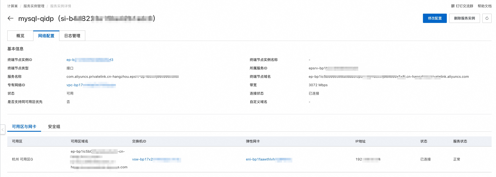
后续若需要关闭/新增/删除私网访问等其他操作，同样可以通过修改配置-网络变配完成。

### 磁盘容量扩容步骤

0. 前提说明 
   1. 本变配示例为用户扩容磁盘容量，服务模板中将"扩容磁盘容量"变配类型设置为升配，即仅能扩容；
   2. 为使磁盘可变配与脚本可执行，服务模板中资源EcsInstanceGroup参数UpdatePolicy需设置为ForAllInstances，资源RunCommand参数Sync需设置为true。
   以上参数模板中均已配置好，此处仅告知。
1. 点击右上角 **修改配置** 进入变配服务实例页面，选择**磁盘容量扩容**。
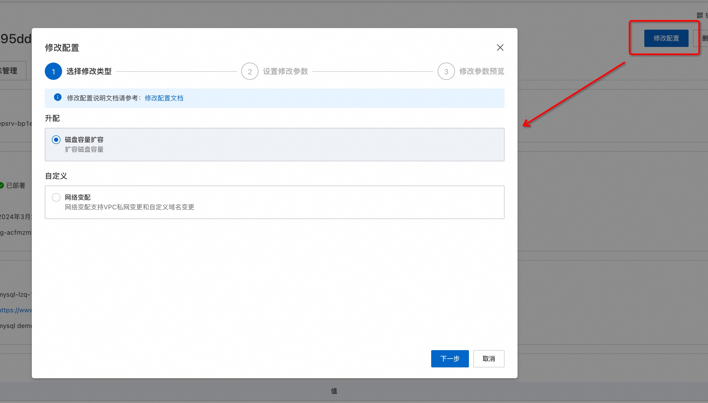
2. 点击**下一步**进入**设置修改参数**，将原有磁盘容量从200GB修改为400GB。
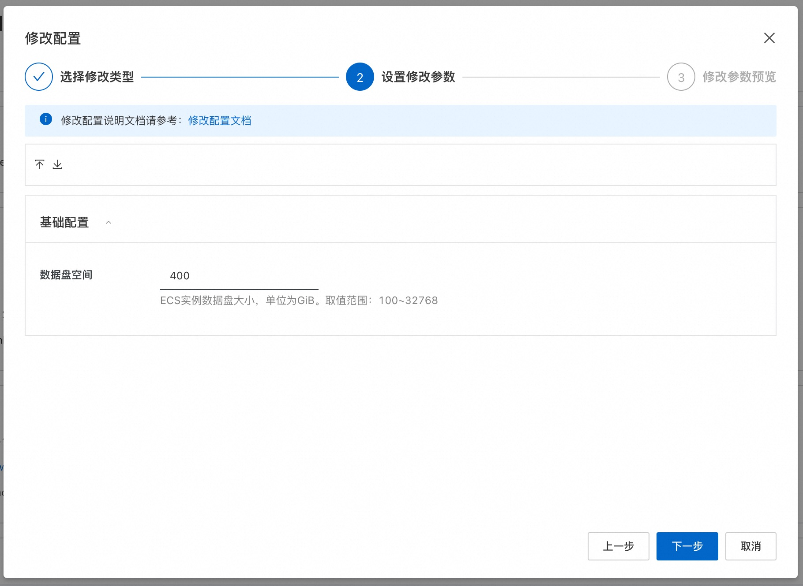
3. 点击**下一步**预览变配参数。
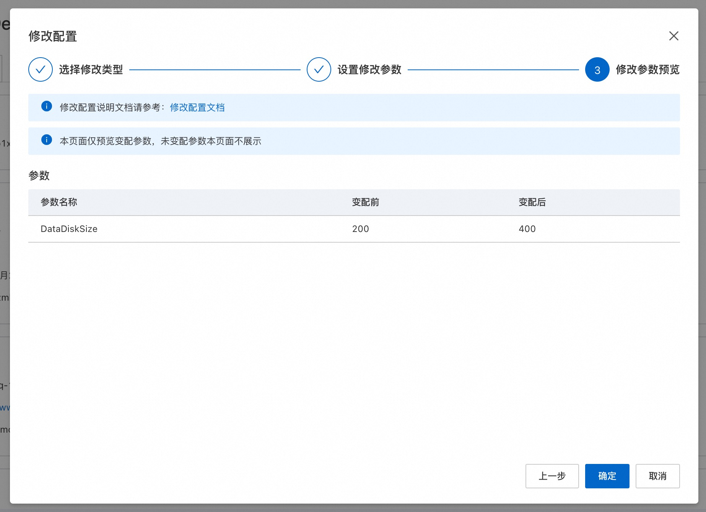
4. 点击确定开始执行变配，等待变配完成。

5. 变配完成，服务实例状态变为已部署。
6. 查看结果：进入服务端ECS 通过命令 df -h 查看，磁盘容量已修改:

    变配前：
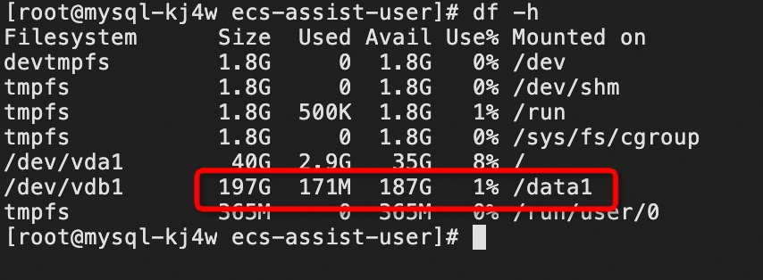
变配后：


## 服务详细说明

本文提前将MySQL社区版安装包存放到该Github Repo中，构建服务过程中会将该安装包发布为计算巢部署物，并在ROS模板写入安装指令，ROS模板引擎在执行时便会自动执行安装了。

```bash
wget '{{ computenest::file::MySQL }}' -O mysql-community-release-el6-5.noarch.rpm
rpm -ivh mysql-community-release-el6-5.noarch.rpm
yum repolist all | grep mysql
yum install mysql-community-server -y
```

{{ computenest::file::MySQL }} 为占位符，会由计算巢服务替换成文件部署物MySQL的http下载地址。

文件说明

| 文件路径                                              | 说明                                                                                                                    |
|---------------------------------------------------|-----------------------------------------------------------------------------------------------------------------------|
| config.yaml                                       | 构建服务的配置文件，服务构建过程中会使用计算巢命令行工具[computenest-cli](https://pypi.org/project/computenest-cli/)，computenest-cli会基于该配置文件构建服务。 |
| parameters.yaml                                   | 本服务为托管版单租，使用该文件渲染服务商需要配置的网络参数，包括VpcId，VSwitch等。                                                                       |
| artifact/mysql-community-release-el6-5.noarch.rpm | MySQL社区版安装包，构建过程会将该包发布为计算巢部署物。                                                                                        |
| icons/service_logo.jpg                            | 构建服务默认的图标。                                                                                                            |
| templates/parameters.yaml                         | 本服务为托管版单租服务，所以只需要用户填写一部分参数，通过该文件指定用户所填参数。                                                                             |
| templates/template.yaml                           | ROS模板文件，ROS模板引擎根据该模板能够自动创建出所有的资源。                                                                                     |

templates/template.yaml主要由三部分组成

1. Parameters定义需要用户填写的参数，包括付费类型，实例规格和实例密码可用区参数。
2. Resources定义需要开的资源，包括新开的Vpc,、VSwitch、ECS、Slb实例、私网连接。
3. Outputs定义需要最终在计算巢概览页中对用户展示的输出

## 服务配置

[创建代运维服务完成实例运维](https://help.aliyun.com/zh/compute-nest/create-a-hosted-operations-and-maintenance-service?spm=a2c4g.11186623.0.i24#task-2167552])

[创建包含变配功能的服务](https://help.aliyun.com/zh/compute-nest/use-cases/create-a-service-that-supports-specification-changes-and-change-the-specifications-of-a-service-instance?spm=a2c4g.11186623.0.i3])

[创建包含服务升级功能的服务](https://help.aliyun.com/zh/compute-nest/upgrade-a-service-instance?spm=a2c4g.11186623.0.i17#task-2236803)

## 服务交付

[自定义服务架构图](https://help.aliyun.com/zh/compute-nest/customize-a-service-architecture?spm=a2c4g.11186623.0.0.56e736bfyUdlFm])

[服务文档上线流程](https://help.aliyun.com/zh/compute-nest/use-cases/publish-documents-to-compute-nest?spm=a2c4g.313309.0.i0])

[将服务上架云市场并上到云市场售卖](https://help.aliyun.com/zh/compute-nest/publish-a-service-to-alibaba-cloud-marketplace?spm=a2c4g.11186623.0.i7])
